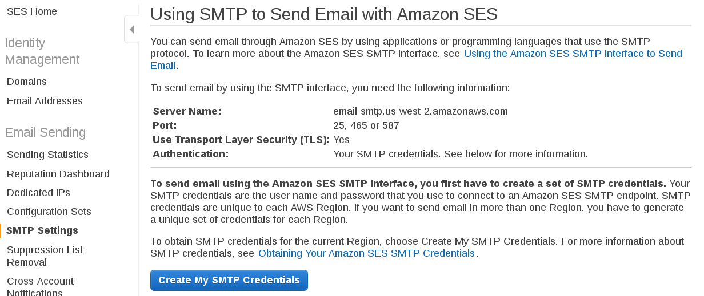

# Raspberry Pi internet-streaming interactive Flask webcam server

## Overview
&#35; TODO

## Installation

Simply clone this repository and run `setup.sh` in the top-level directory,
specifying the port you'd like the server to listen on (i.e., the port that
will be opened up to the world) with the `-p`/`--port` flag. **IMPORTANT**:
If you wish to run the program in a Python virtual environment (which is
recommended), ensure that the virtual environment is activated before running
`setup.sh`.

```
git clone https://github.com/nrsyed/flask-cam.git
cd flask-cam
./setup.sh --port 9001
```

Replace `9001` with the port you wish to use (the standard HTTPS port
is 443, but it may be prudent to choose a different port for obscurity). After
the necessary packages have been installed and configuration files have been
created, the script will prompt you to set up an authorized username/password.
These credentials will be required by the web interface to view the
livestream webpage. For more information on user authentication, see the
[User Authentication](#user-authentication) section below.

As part of the installation process, the `opencv-python` Python package is
installed. However, some users may wish to build/install OpenCV manually (for
example, using the instructions at
<a href="https://www.pyimagesearch.com/2018/09/26/install-opencv-4-on-your-raspberry-pi/">
pyimagesearch</a>). For this reason, `opencv-python` is not included in
`requirements.txt` (but is installed by `setup.sh`). If you wish to skip
installation of `opencv-python`, pass the `--skip-opencv` flag to `setup.sh`:

```
./setup.sh --port 9001 --skip-opencv
```

**NOTE**: This project relies on `uvcdynctrl` because it assumes that a webcam
supported by `uvcdynctrl` is being used. If this is not the case, `camera.py`
must be modified based on the specifics of your particular webcam(s).


## Usage

&#35; TODO

Before you can access the webpage from the internet, you must modify your
router's port forwarding settings to direct traffic on the chosen port (9001 in
the example above) to the Raspberry Pi. Depending on your router, this may
require you to know the Raspberry Pi's IP address on the local network, which
can be obtained via `ifconfig`.

To access the app, use your public IP address and the port you chose above.
You can obtain your public IP address using the `dig` tool, which is part of
the `dnsutils` package and is installed by `setup.sh`.

```
dig +short myip.opendns.com @resolver1.opendns.com
```

Then, to access the index page of the app, simply navigate to
`https://123.4.567.890:9001` in a web browser, replacing `123.4.567.890` with
the IP address returned by `dig` and `9001` with the port selected above.


## Uninstallation

To uninstall all components and configuration files, simply run `setup.sh` with
the `uninstall` option:

```
./setup.sh uninstall
```


## User authentication

The Flask application requires username/password authentication to access the
index page. Passwords are encrypted and authenticated via `bcrypt`. To add a
user, run `password.py` with the `-a`/`--add-user` flag, specifying the
username with the `-u`/`--user` option and the password with the
`-p`/`--password` option. Replace `dexter` with your desired username and
`omelet` with your desired password.

```
python password.py --add-user --user dexter --password omelet
```

By default, this creates a file named `users` in the application directory,
which contains the username and the base-64 encoded hash of the password.
Additional users can be added by the same process.

To modify an existing user's password or to delete a user from the list, use
the `-m`/`--modify-user` and `-d`/`--delete-user` flags, respectively.

```
# Modify a user's password.
python password.py --modify-user --user dexter --password hunter2

# Delete a user.
python password.py --delete-user dexter
```

To check a user's password, use the `-c`/`--check-password` flag, which prints
`True` if the password given is correct and `False` otherwise.

```
$ python password.py --check-password --user dexter --password 1234
False

$ python password.py --check-password --user dexter --password hunter2
True
```


## Email alerts

There are a number of ways to send email alerts initiated by events on the
Raspberry Pi. Because it's relatively easy and doesn't require storing or
using the credentials for my primary Gmail account, I've opted to use
<a href="https://aws.amazon.com/ses/">Amazon AWS SES</a>
(**S**imple **E**mail **S**ervice). You'll have to create an Amazon
AWS account first if you don't have one.

On the Amazon AWS SES page, go to SMTP settings and make note of the
**server name** and **port** choices; these will be needed later (see the
screenshot below).



Click *Create My SMTP Credentials* and follow the instructions therein. At the
end of the process, you'll be presented with an SMTP username and password;
these credentials will be required to communicate with the AWS mail server
(refer to the screenshot below).


Following this step, go to the Email Addresses link under Identity Management
in the navigation bar (refer to the first screenshot above), click
*Verify a New Email Address*, and follow the instructions to add the email
address you'd like to send email from.

Finally, copy the sample file <a href="secrets.example">`secrets.example`</a>
to a file named `secrets` and replace the example information with your email
address and the AWS SES credentials from the previous steps. The secrets file
contains all of the information needed to communicate with the AWS SES server
in the form of a JSON object; the file is parsed by the `import_secrets()`
function in <a href="sendmail.py">`sendmail.py`</a>.

Currently, an email alert is sent whenever your router's external IP address
(the IP address that other computers see when any machine on your network
communicates with the outside world) changes, since most residential customers
have a dynamic IP address that can change from time to time. This ensures that
you always have the correct IP address to access your webcam feed. This is
achieved by means of the <a href="scripts/make_external_ip_check_cronjob.sh">
`make_external_ip_check_cronjob.sh`</a> script that runs on installation, which
adds a cron job to regularly run <a href="scripts/external_ip_check.sh">
`external_ip_check.sh`</a>, another script that calls `sendmail.py` if the IP
has changed since the last check. Note that the secrets file does not have to
be named `secrets`; however, if a different name is used, it must be passed
to `sendmail.py` via the `--filepath` option in `external_ip_check.sh`.
