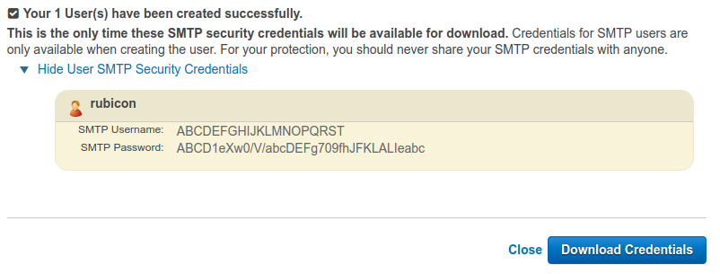

# Raspberry Pi internet streaming Flask webcam server

## Overview
&#35; TODO

## Installation and setup

Install the necessary system packages. Note that this repository relies on
`uvcdynctrl` because it assumes that a webcam supported by `uvcdynctrl` is
being used. If this is not the case, installation of `uvcdynctrl` may be
omitted and `camera.py` must be modified based on the specifics of your
particular webcam(s).

```
sudo apt -y install dnsutils libffi-dev nginx uvcdynctrl
```

Clone this repository, then install the necessary Python packages, preferably
in a virtual environment. Note that OpenCV is also required but is not listed
in `requirements.txt`. It may be built/installed manually (for example, using
the instructions at
<a href="https://www.pyimagesearch.com/2018/09/26/install-opencv-4-on-your-raspberry-pi/">
pyimagesearch</a>) or via the prebuilt `opencv-python` package on PyPI.


```
git clone https://github.com/nrsyed/flask-cam.git
cd flask-cam
pip install -r requirements.txt
```

Ensure your Python virtual environment is activated (if using one), *then* run
`make_systemd_file.sh` in the `scripts` directory to create a systemd unit file
that will allow Gunicorn to serve the application as a service, named `flaskcam`.

```
scripts/make_systemd_file.sh
```

To configure Nginx to properly route requests to gunicorn, create the file
`/etc/nginx/sites-available/flaskcam` and fill it out as follows, replacing the
port `9001` with the port you'd like your server to use, the sample IP address
`192.168.1.101` with the IP address of your Raspberry Pi on your local network
(which can be found with the `ifconfig` command), and the path to the flask-cam
repository directory (`/home/pi/flask-cam/`) with your own, if you've placed it
in a different directory. Note that the standard HTTP port is 80, but it may be
prudent to choose a different port for obscurity.

```
server {
    listen 9001;
    server_name 192.168.1.101

    location / {
        include proxy_params;
        proxy_pass http://unix:/home/pi/flask-cam/flaskcam.sock;
    }
}
```

Enable this configuration by symlinking it in the Nginx `sites-enabled` directory.

```
sudo ln -s /etc/nginx/sites-available/flaskcam /etc/nginx/sites-enabled
```

Test the configuration file you just created by running `nginx` with the `-t`
flag. If this indicates no errors, restart the Nginx service to effect the
changes.

```
sudo nginx -t
sudo systemctl restart nginx
```

Assuming you're running
<a href="https://wiki.archlinux.org/index.php/Uncomplicated_Firewall">ufw</a>,
allow connections on the port you chose above.

```
sudo ufw allow 9001
```

The Flask application requires username/password authentication to access the
index page. Passwords are encrypted and authenticated via `bcrypt`. To add a
user, run `password.py` with the `-a`/`--add-user` flag, specifying the
username with the `-u`/`--user` option and the password with the
`-p`/`--password` option. Replace `dexter` with your desired username and
`omelet` with your desired password.

```
python password.py --add-user --user dexter --password omelet
```

By default, this creates a file named `users` in the application directory,
which contains the username and the base-64 encoded hash of the password.
Additional users can be added by the same process. For more information on
working with the list of allowed users, refer to the section on
<a href="#user-authentication">user authentication</a> below.

The final step is modifying your router's port forwarding settings (assuming
you're accessing the internet from behind a router) to forward the port
previously selected (9001 in the example above) to your Raspberry Pi's local
IP address, which, again, can be obtained via `ifconfig`.

To access the app, use your public IP address and the port you chose above.
You can obtain your public IP address using the `dig` tool, which is part of
the `dnsutils` package.

```
dig +short myip.opendns.com @resolver1.opendns.com
999.9.999.999
```

Then, to access the index page of the app, simply navigate to
`999.9.999.999:9001` in a web browser, replacing `999.9.999.999` with the IP
address returned by `dig` and `9001` with the port you chose previously.

## User authentication

To modify an existing user's password or to delete a user from the list, use
the `-m`/`--modify-user` and `-d`/`--delete-user` flags, respectively.

```
# Modify a user's password.
python password.py --modify-user --user dexter --password hunter2

# Delete a user.
python password.py --delete-user dexter
```

To check a user's password, use the `-c`/`--check-password` flag, which prints
`True` if the password given is correct and `False` otherwise.

## Email alerts

There are a number of ways to send email alerts initiated by events on the
Raspberry Pi. Because it's relatively easy and doesn't require storing or
using the credentials for my primary Gmail account, I've opted to use Amazon
AWS SES (*S*imple *E*mail *S*ervice).

&#35; TODO


